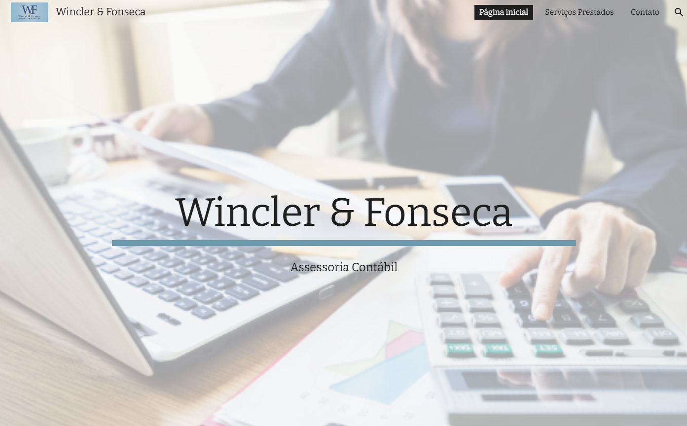

<h1 align="center"> WinclerFonseca </h1>

Projeto de site Wincler&Fonseca, com apresentação de serviços prestados e modos de contato com a empresa.  
<a href="https://sites.google.com/view/wfcontabil/p%C3%A1gina-inicial">Site para visualização do projeto</a>  
 
<a href="https://fonsecaw.github.io/WF_contabilidade/">Aplicação Final</a>

  <a href="#-tecnologias">Tecnologias</a>&nbsp;&nbsp;&nbsp;|&nbsp;&nbsp;&nbsp;
  <a href="#-projeto">Projeto</a>

  

 

## 🚀 Tecnologias

Esse projeto foi desenvolvido com as seguintes tecnologias:

- HTML e CSS
- JavaScript
- Git e Github

## 💻 Projeto

O Site é um atividade para entrega final do curso Decsodificadas.

- [Acesse o Youtube Descodificadas](https://www.youtube.com/channel/UCQW-A6gKHPMrcOVuKuRe2sQ)
